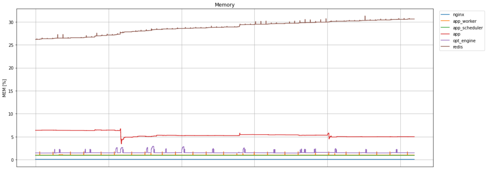

# Analyse Docker Stats With Jupyter Notebook
Docker has a great tool for watching current CPU, memory and I/O in our containers - [docker stats](https://docs.docker.com/engine/reference/commandline/stats/). The output is streamed and we can get a quick insight of the current situation, though it's hard to see if any memory is lost over time. For that we need to store the output over a longer period of time for later analysing.

# TL;DR;
Pipe the output of `docker stats` with the flag `--no-stream` into a csv-file. Load the log files with `pandas.read_csv` and format the data to standardize the units. View an example on this github repo.

# Logging Docker Stats
Let's start with creating a folder to store the log files in. We don't want to pollute the root folder with csv-files now, do we?

```bash
mkdir docker-stats-logs
cd docker-stats-logs
```

For the loggin, we'll simply run `docker stats` and pipe the output into a csv-file every 10th second. We can name the file to the current date to separate the logs so each file doesn't get too large. Let's use `date` to create the filename with ./`date -u +"%Y%m%d.csv"`. The script is cancelled with `ctrl/cmd+c`.

```bash
while true; do docker stats --no-stream | cat >> ./`date -u +"%Y%m%d.csv"`; sleep 10; done
```

## Download The Log Files
If we're logging the data on a server, we'll have to download it to our local machine. This can be done with secure copy protocol [scp](https://linux.die.net/man/1/scp).

```bash
scp -i <your-pem-key> <user>@<address>:docker-stats-logs/<date-of-file>.csv .
```

# Analyse The Data With Pandas in Jupyter Notebook
Assuming you have multiple log files that needs to be read into the same data frame, we can use the standard `glob` and `os.path` modules to fetch the filenames. Make sure to sort the filenames so the data is in chronological order.

```python
import os
from glob import glob

ROOT_PATH = os.path.abspath("..")

raw_data_filenames = glob(os.path.join(ROOT_PATH, "assets/*.csv"))
raw_data_filenames.sort()
```

## Creating The DataFrame
We'll use Pandas so read the csv-files and create the data frames. The columns in the log files will unfortunately not be separated by semicolon or tabs, we'll have to split the columns by multiple white spaces. This can be easilly done with `delimiter=r"\s\s+"`. Pandas has a function, `df.concat`, that we'll use to merge the data from all log files into the same data frame.

```python
df = pd.concat(
    [
        pd.read_csv(filename, delimiter=r"\s\s+", engine="python")
        for filename
        in raw_data_filenames
    ],
    axis=0,
    ignore_index=True,
)
```

If we inspect the log files, we'll se that docker stats prints the header for every timestamp.
```csv
CONTAINER ID        NAME                                           CPU %               MEM USAGE / LIMIT     MEM %               NET I/O             BLOCK I/O           PIDS
cb815173b14c        nginx                0.00%               5.828MiB / 7.448GiB   0.08%               913MB / 943MB       36.9kB / 8.19kB     0
CONTAINER ID        NAME                                           CPU %               MEM USAGE / LIMIT     MEM %               NET I/O             BLOCK I/O           PIDS
cb815173b14c        nginx                0.00%               5.828MiB / 7.448GiB   0.08%               913MB / 943MB       36.9kB / 8.19kB     0
CONTAINER ID        NAME                                           CPU %               MEM USAGE / LIMIT     MEM %               NET I/O             BLOCK I/O           PIDS
cb815173b14c        nginx                0.00%               5.828MiB / 7.448GiB   0.08%               913MB / 943MB       36.9kB / 8.19kB     0
```

Let's remove those repeading headers from the data frame.
```python
df = df[df.NAME != "NAME"]
```

Now, for the tricky part. How do we get any workable values for fields like `MEM USAGE / LIMIT` where the value are `5.828MiB / 7.448GiB`?

Let's create some handy functions to help us out. Firstly we'll need to split the column `MEM USAGE / LIMIT` into two different ones, one for memory usage and one for memory limit. We know that the split will be around the slash, so let's create a function to either take the first (left) or second (right) element.

```python
def split_on_slash(df_col, split_index):
    return df_col.apply(lambda x: x.split(" / ")[split_index])
```

Next, we'll have to standardize the unit since memory unit is in MiB and limit in GiB. When the value is `5.828MiB`, we need to split it up into the numbers (and decimal) `5.828` and the string `MiB`. This can be done with some regex and the standard python module [re](https://docs.python.org/3/library/re.html). Combined, we can create a function `to_bit` that will convert the entries to the same magnitude.
```python
import re

def get_only_characters(string):
    return re.sub('[^a-zA-Z]+', '', string)

def get_only_numbers(string):
    return float(re.sub('[^\d\.]', '', string))

def to_bit(value):
    return int({
        "b": get_only_numbers(value) * 1,
        "kib": get_only_numbers(value) * 10e3,
        "kb": get_only_numbers(value) * 10e3,
        "mib": get_only_numbers(value) * 10e6,
        "mb": get_only_numbers(value) * 10e6,
        "gib": get_only_numbers(value) * 10e9,
        "gb": get_only_numbers(value) * 10e9,
    }.get(get_only_characters(value).lower(), 0))
```

The percentage attributes `MEM %` and `CPU %` are easier to parse. We simply have to remove the last character, i.e. the percentage sign, and convert the value to a float.

```python
def percentage_to_float(df_col):
    return df_col.apply(lambda x: float(x[0:-1]))

df["mem_percentage"] = percentage_to_float(df["MEM %"])
df["cpu_percentage"] = percentage_to_float(df["CPU %"])
```

## Plotting Memory Usage
Let's plot the memory usage and see if we have any pesky memory leaks. For the plotting, let's use [Seaborn](https://seaborn.pydata.org/). Seaborn is based on [matplotlib](https://matplotlib.org/) and makes plotting a bit easier, but still allows the customizability of matplotlib.

First thing first; the standard size of plots are just too small - let's enlarge it a bit with `figsize`. Since docker stats doesn't log the timestamps, we might as well remove the ticks on the x-axis.

```python
fig, ax = plt.subplots(1, 1, figsize=(18, 7))

sns.lineplot(x=df.index, y="mem_percentage", hue="NAME", data=df, drawstyle="steps")
plt.legend(bbox_to_anchor=(1.01, 1), loc='upper left')
plt.ylabel("MEM [%]")
plt.title(f"Memory")
plt.tick_params(axis='x', which='both', bottom=False, top=False, labelbottom=False)
plt.grid()
plt.show()
```



Take a look at that! The redis memory is increasing! Better have an eye on that one 🕵️

# Conclusion
It would be great if docker stats could store to a file and not only support us with streamed snapshots of the current state. Though, when piped into a csv-file it is useful to have that extra information when tracking down a memory leak - especially when your cloud provider does not have a tool for displaying memory used. I believe the main takeaway from this is the power of Pandas, that tool never stops to amaze.